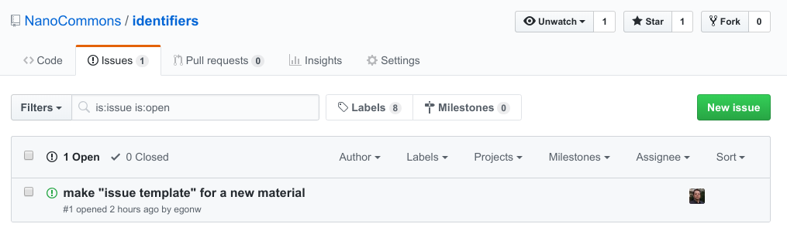
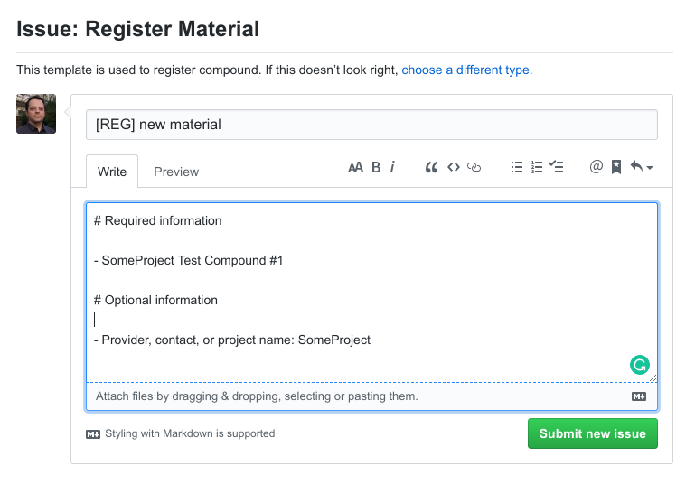
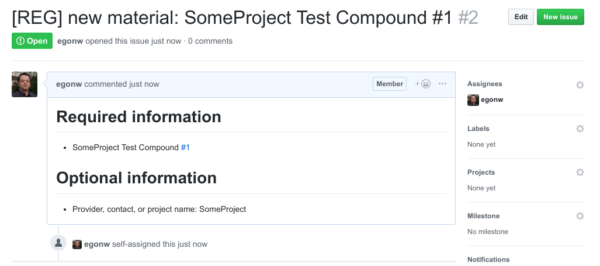

# How to register new materials

The following step explain how to register new materials. Mind you, for each material, please create a new issue.

## Step 1. Aggregate the information

The first step is to aggregate the information you want to have associated with the
newly minted identifier. There is required and optional information: only the name
or label is required, and all other information is optional.

## Step 2: Create a registry request

In the [Issues]() section you can click the green **New issue** button:

You can then select the **Register Material** template by clicking the green **Get started** bytton:

You can then fill out the template using the information aggregated in Step 1.
For example:

When done, click the green **Submit new issue** button. The result will be a new **issue**
in the registry's tracker, which will looks something like this:

# Step 3: Await assignment of an identifier

Then it is waiting for the identifier to be minted. This is a manual step but the responsible people
are automatically informed about your request. Write down the link to your request in the
[Issues tracker](https://github.com/NanoCommons/identifiers/issues).
Once the identifier is ready, you will be informed using this tracker.

# Alternative Registration Methods

Alternatively, use one of the two other options. The first is to send
email with the required and optional information to Egon Willighagen.
The second option, and this is for more experienced git users, is to take
the template from this repository and make a pull request, with one new file
based on that template for each material. This request will be reviewed and
assigned identifiers.
